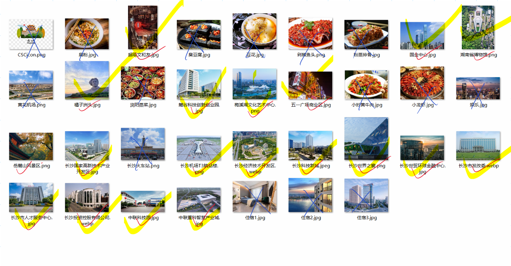
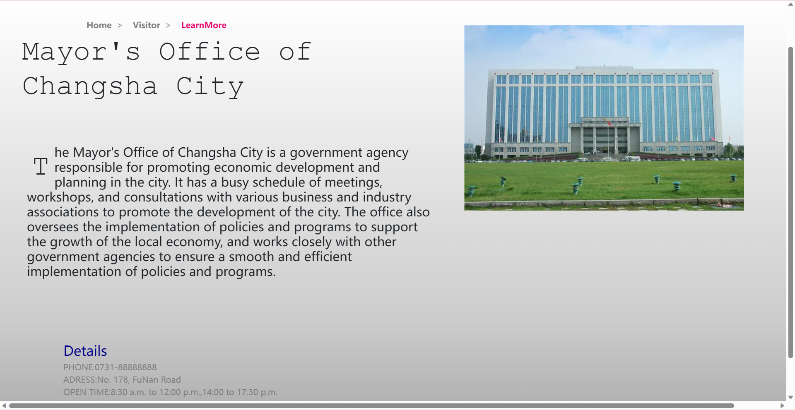
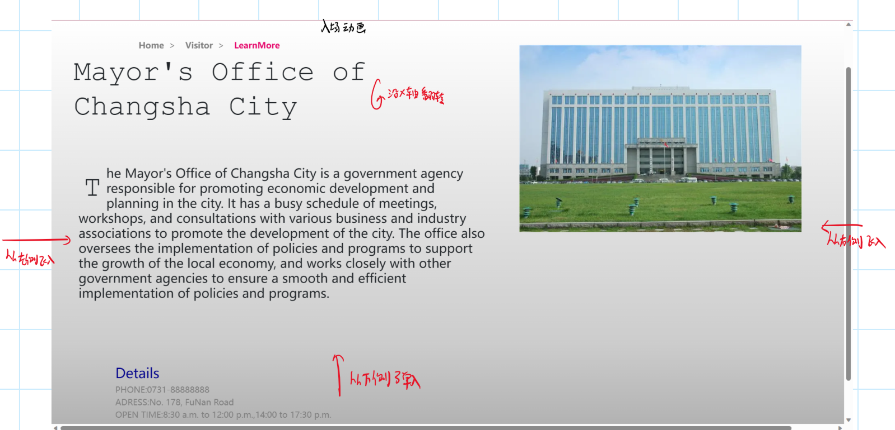
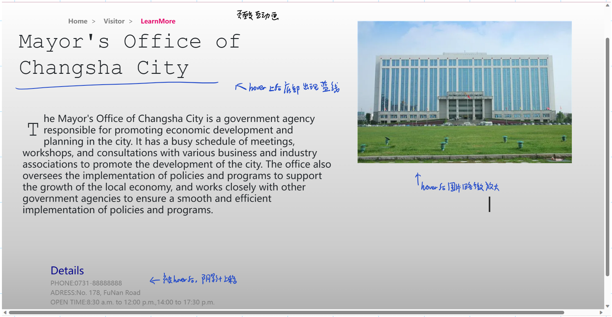
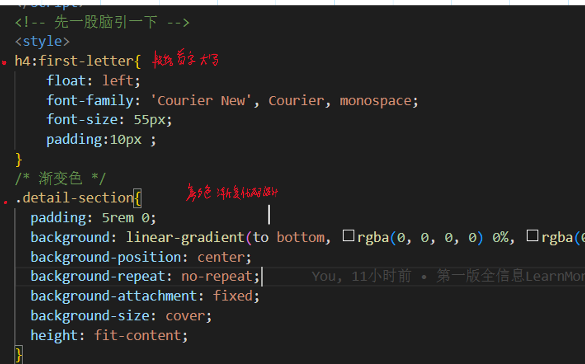
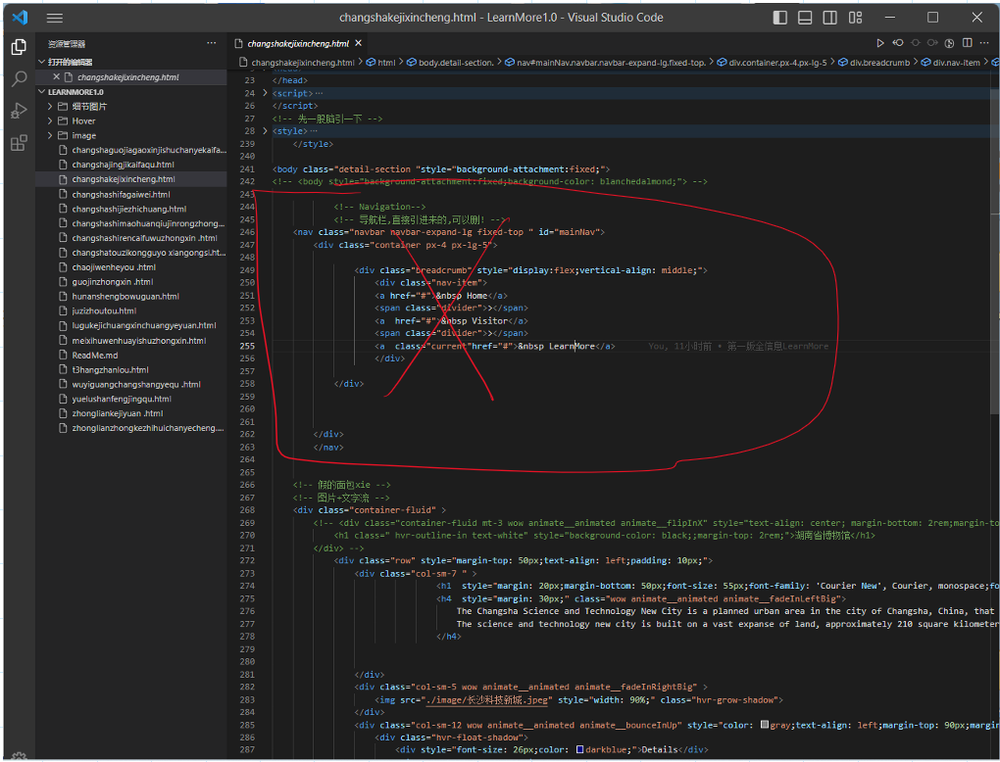

## **More Information**

*2020213299-王子龙*

内容包含以下页面:

有落下的内容的话及时沟通补充哈.

##### **命名规范**:地点名称的英文拼音,全小写.加链接的时候vscode应该能自动联想,感觉会方便一些

# **文件夹结构:**

**HOVER文件夹:从网上下载的特效库,勿删**

*其他的库,如bootstrap,animate.css,wow.js,全部改成从网络上引库,把本地文件删了.*

**image文件夹:就是secondarypage的图片文件夹,里面命名都是一样的**

##### **细节图片文件夹:建议保留.里面有模版,还存了readme的图片**

*反正也不占多大地方*

#### ***<u>总之一句话:俺觉得都重要,一个也别删</u>***

# 内容介绍

有一小部分是自己写的,上网查的资料1.大部分是用**chatgpt**生成的.因为内容有点多并且时间紧张,有些细节可能**未经考察**.有问题的话及时与我沟通,然后我**尽快**更改.

*(话说老师不会真的一个一个地址去查信息正确与否吧....)*

# 页面设计

**页面静态展示**

**页面开场动画设计**

**页面交互特效设计**(*在hover文件夹里,所以不要把hover文件夹给删了*)

**背景**:采取主页的渐变色设计

# 代码介绍

头文件和script文件别删

### style

**style**中下面俩别删

  段落首字大写+颜色渐变      

剩下的是从**secondarypage**那里抄过来的导航栏的css样式,感觉删除**应该**没有什么大问题

### body

导航栏部分可删!

下面的就是具体内容.建议不要动.有更改的话可以联系我!

先就这样!<u>多沟通,多交流!</u>

